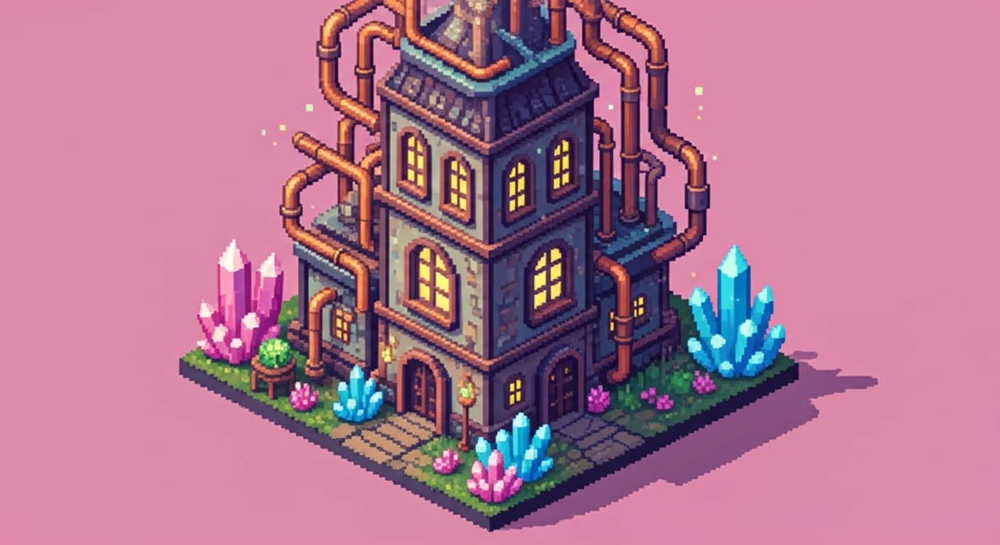

# Building: Alchemy Lab

## Description
The Alchemy Lab is a crafting station where [Ingredients](../Ingredient.md) are combined to create potions, pills, and other magical concoctions.

## Visual Concept

## Core Attributes
- **Footprint**: 2x2 Tiles
- **Requires**: 1 [Character](../Character.md) with the Alchemist role.

## Production Chains
- **Input**: [Glowing Plant](../Ingredient.md), Water.
- **Output**: Minor Health Potion.
- **Input**: [Energy Crystal](../Resources/Resource.md), Crushed Minerals.
- **Output**: Energy Pill (used for [Progression](../../Systems/Progression.md)).

## Upgrade Tiers
- **Tier 1 (Apothecary's Table)**: Basic potions and pills. 1 crafting slot.
- **Tier 2 (Alchemist's Laboratory)**: Unlocks procedural ingredient experimentation. Adds an efficiency bonus. 2 crafting slots.
- **Tier 3 (Arcane Atelier)**: Unlocks transmutation of resources and creation of powerful elixirs. Requires a connection to a magical energy source.
