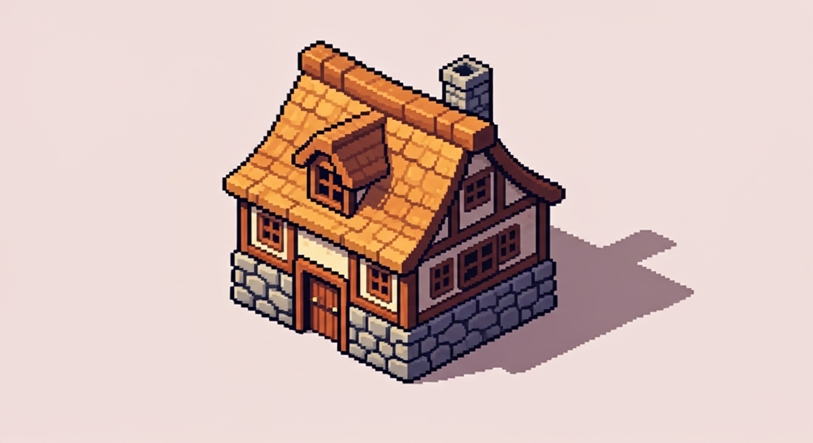

# Entity: Building

## Description
Buildings are structures placed on the [flying island's](../Island.md) tile grid. They are the heart of the village, enabling resource production, crafting, housing for [characters](../Character.md), and progression.

## Visual Concept

## Core Concepts
- **Building Footprint**: Each building occupies a specific number of tiles (e.g., 2x2, 3x3), requiring strategic placement.
- **Upgrade Tiers**: Most buildings can be upgraded through several tiers. Upgrading costs resources but increases efficiency, unlocks new production recipes, or provides new functionalities.
- **Adjacency Bonuses**: Placing certain buildings next to each other can provide passive bonuses (e.g., a Storehouse next to a Mine might increase the Mine's output).

## Building Categories
Detailed information on each building can be found in the [Buildings](./Buildings/) subdirectory.
- **Production**: Generate raw resources (e.g., Sawmill, Mine).
- **Crafting**: Process resources into finished goods (e.g., Forge, Alchemy Lab).
- **Housing**: Provide shelter for characters to rest (e.g., Cottage).
- **Storage**: Increase the village's capacity for storing resources.
- **Progression**: Facilitate character and village advancement (e.g., Energy Obelisk).

## Related Systems
- [Village Management](../../Systems/VillageManagement.md)
- [Crafting](../../Systems/Crafting.md)