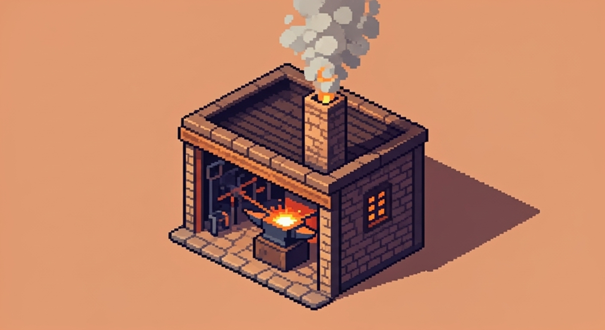

# Building: Forge

## Description
The Forge is a crafting station where raw ores and other materials are smelted into ingots and then forged into [Equipment](../Equipment.md).

## Visual Concept

## Core Attributes
- **Footprint**: 3x3 Tiles
- **Requires**: 1 [Character](../Character.md) with the Blacksmith role.

## Production Chains
- **Input**: [Wood](../Resources/Wood.md) (as fuel), Iron Ore, Coal.
- **Output**: Iron Ingots.
- **Input**: Iron Ingots.
- **Output**: Iron Swords, Iron Armor.

## Upgrade Tiers
- **Tier 1 (Stone Forge)**: Basic iron and copper equipment. 1 crafting slot.
- **Tier 2 (Reinforced Forge)**: Unlocks steel smelting. Adds an efficiency bonus. 2 crafting slots.
- **Tier 3 (Magma Forge)**: Unlocks magical alloy smelting. Requires a connection to a lava source. Adds a chance to grant bonus magical properties to crafted items.
