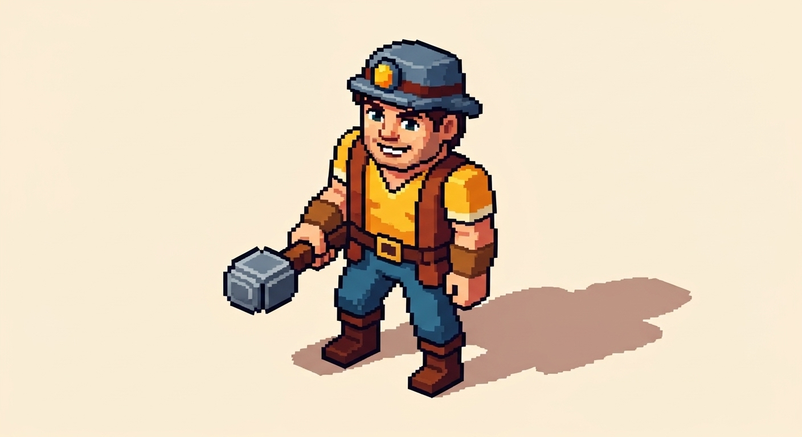

# Entity: Character

## Description
Characters are the inhabitants of the player's [flying island](./Island.md). While the player doesn't control them directly like an RPG, they are managed by assigning roles, scheduling tasks, and tending to their needs. Each character is unique, with distinct traits and skills.

## Visual Concept

## Core Attributes
- **Health**: Their physical well-being. Decreases from hazards during expeditions.
- **Stamina**: Their energy for performing tasks. Depletes over the workday and is restored by resting.
- **Morale**: Their overall happiness. Influenced by food quality, rest, and successful expeditions. High morale can lead to productivity boosts.

## Needs
Characters have basic needs that must be met to keep them functional and happy.
- **Food**: Consumed daily. Better quality food provides a morale boost.
- **Rest**: Characters need to sleep in a designated building (e.g., a house) to recover stamina.

## Skills & Roles
Each character has a set of skills that determine their proficiency in a given role. See the [Roles and Professions](../Gameplay/Roles.md) document for a detailed list of all available jobs.

## Tier Progression
Characters advance through tiers via the main [Progression System](../Systems/Progression.md). Each tier unlocks:
- The ability to learn more complex roles.
- Permanent boosts to their core attributes.
- New traits or abilities.

## Related Systems
- [Village Management](../Systems/VillageManagement.md)
- [Progression System](../Systems/Progression.md)