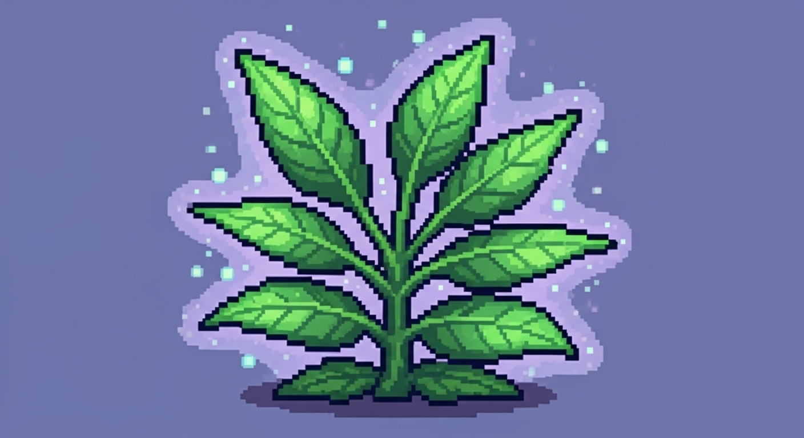

# Entity: Ingredient

## Description
Base components used in alchemy and smithing. They can be combined to create new items. Alchemy aims to create a "near-infinite amount of plants" with varied properties.

## Visual Concept

## Associated Concepts
- **Ingredient Types**:
  - **Chemical**: "Active principles" similar to molecules.
  - **Procedural**: "Fire iron mineral" that imparts specific attributes.

## Related Systems
- [Crafting](../Systems/Crafting.md)
- [Exploration](../Systems/Exploration.md) (motivation to find rare ingredients)
