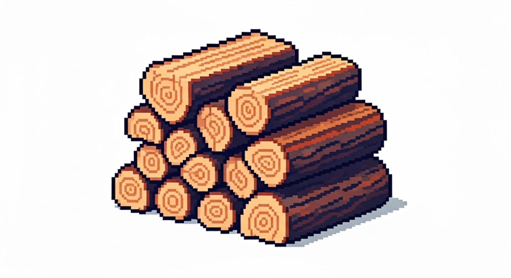

# Resource: Wood

## Description
A primary resource gathered by Woodcutters. It is used as a basic building material and as fuel for crafting stations like the [Forge](../Buildings/Forge.md).

## Visual Concept

## Associated Concepts
- **Gathering**: Collected by [Characters](../Character.md) with the **Woodcutter** [role](../../Gameplay/Roles.md).
- **Usage**: A key ingredient in construction and crafting recipes.

## Related Systems
- [Village Management](../../Systems/VillageManagement.md)
- [Crafting](../../Systems/Crafting.md)
