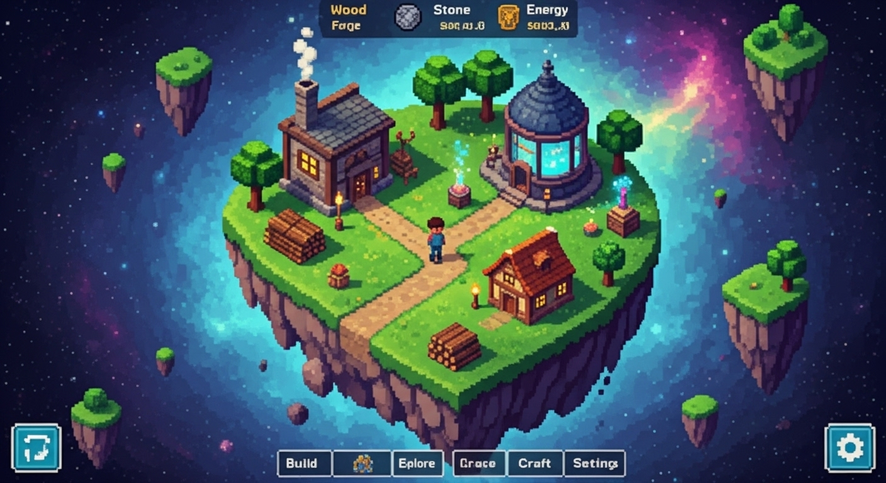
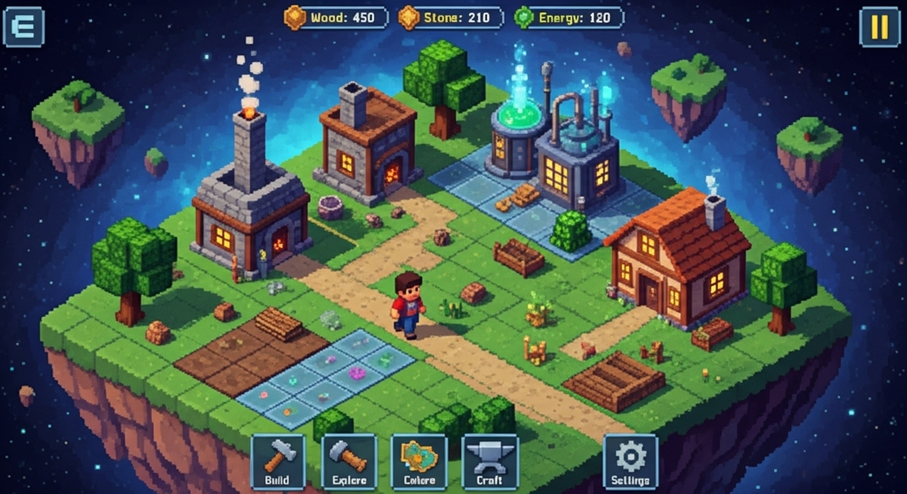

# Aethelgard - Game Design Repository

Welcome to the official repository for **Aethelgard**, a game concept centered around city-building, crafting, and exploration on a magical flying island. This repository contains the complete and actively developed design documentation, as well as utility scripts for asset creation.

## Project Vision

Aethelgard is envisioned as a charming management game with deep crafting and progression systems, designed with a "passive management" philosophy suitable for mobile platforms. The player acts as the overseer of a village on a flying island, guiding its growth by assigning roles to characters, planning the village layout on a tile-based grid, and exploring a vast, mysterious world.

The core aesthetic is **2D isometric pixel art**, focusing on a vibrant, colorful, and whimsical fantasy style.

### Homescreen Concept
The following image is a generated concept of the game's main screen, showcasing the island, the UI, and the overall mood.

## Documentation

All game design documentation is located within the `Plan/` directory. It is structured as a comprehensive network of interlinked Markdown files. To get started, begin with the master index.

**[Click here to enter the Game Plan](./Plan/README.md)**

The documentation details everything from core gameplay loops like the **[Day-Night Cycle](./Plan/Game/Gameplay/DayNightCycle.md)** to granular descriptions of each **[Building](./Plan/Game/Entities/Buildings/)** and **[Character Role](./Plan/Game/Gameplay/Roles.md)**.

### City-Builder Mechanics
A central feature of Aethelgard is its tile-based city-building system. Players must strategically place buildings on the island's grid to optimize production and manage space.

## Scripts & Utilities

The `scripts/` directory contains Python scripts used to support the design process, including:
- **`generate_png_asset.py`**: A tool for generating concept art using the Vertex AI platform.
- **`downscale_image.py`**: A utility for converting generated images into a pixel art style.

For more information, please see the **[Scripts README](./scripts/README.md)**.
